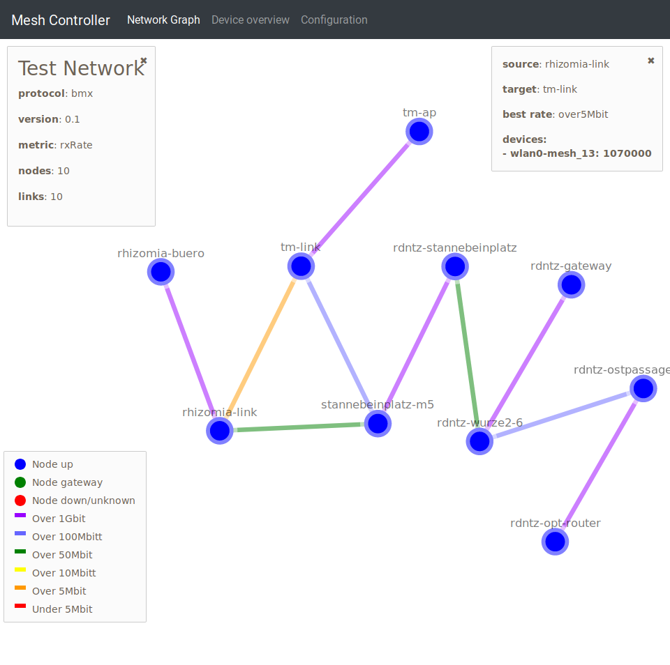

# meshrc

## meshrc-web

Uses the
[prometheus-node-exporter-lua](https://github.com/openwrt/packages/tree/master/utils/prometheus-node-exporter-lua)
with bmx7 plugin to generate valid [NetJson](http://netjson.org/) which can be
visualized via [netjsongraph.js](https://github.com/netjson/netjsongraph.js)



Also creates an simple overview & allow configuration of the mesh via `meshrc-client`.


## meshrc-cli

Has various command to set the mesh configuration:

```
Usage: ./cli.sh
    -h --help                           : show this message
    -i --shortid <shortid>              : short id of node to be configured
    -l --list-nodes                     : show all nodes of mesh network
    -n --node-name <name>               : sets node name for given shortId
    -a --ap-pass <passworkd>            : set access point password of all nodes
    -m --mesh-pass <passworkd>          : set mesh password of all nodes
    -f --firstboot                      : resets all nodes by removing overlayfs
    -r --raw                            : runs given command directly on node
    -s --set-ssh <ssh_keys>             : set ssh key to all nodes
Examples:
    ./cli.sh -i ABCD1234 -a "individual-ap-password"
    ./cli.sh -i ABCD1234 -i BCDE2345 -r "reboot"
    ./cli.sh -m "new-mesh-password"
```

The command transport is done via `bmx7-sms` and requires clients that trust the
sending node.

## meshrc-client

Run the commands received from the cli.
