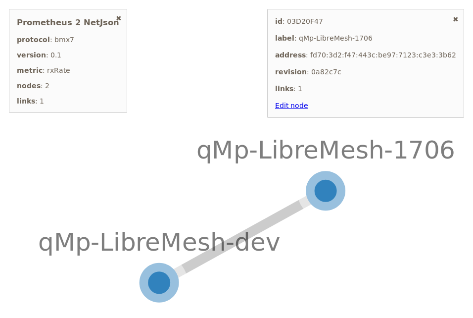

# mesh-cc

## prometheus_to_netjson.py

Uses the
[prometheus-node-exporter-lua](https://github.com/openwrt/packages/tree/master/utils/prometheus-node-exporter-lua)
with bmx plugin to generate valid [NetJson](http://netjson.org/) which can be
visualized via [netjsongraph.js](https://github.com/netjson/netjsongraph.js)

### Example output:

    init
    get nodes prometheus in 4.599ms
    get links prometheus in 3.237ms
    merged links in 0.038ms
    removed offline links in 0.004ms
    dumped netjson.json:
    {
      "type": "NetworkGraph",
      "label": "Prometheus 2 NetJson",
      "protocol": "bmx7",
      "version": "0.1",
      "metric": "rxRate",
      "nodes": [
        {
          "id": "03D20F47",
          "label": "qMp-LibreMesh-1706",
          "properties": {
            "address": "fd70:3d2:f47:443c:be97:7123:c3e3:3b62",
            "revision": "0a82c7c"
          }
        },
        {
          "id": "71BE6B6F",
          "label": "qMp-LibreMesh-dev",
          "properties": {
            "address": "fd70:71be:6b6f:cb55:3487:6c16:9405:e16a",
            "revision": "0a82c7c"
          }
        }
      ],
      "links": [
        {
          "source": "03D20F47",
          "target": "71BE6B6F",
          "properties": {
            "devs": {
              "wlan0-adhoc_13": "51670",
              "wlan0-mesh_13": "52729",
              "wlan1-adhoc_13": "52729",
              "wlan1-mesh_13": "52729"
            }
          }
        }
      ]
    }
    dump json in 0.386ms

