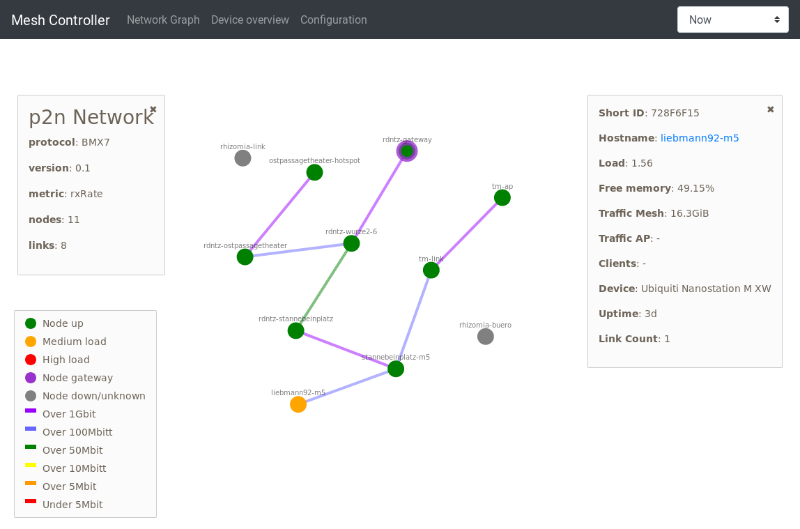

# meshrc 

Tool set to simplify monitoring and managing of a mesh network. All software
was created within my bachelor thesis. Feel free to comment & grumble.

Scope during development was the distribution of internet uplink for festivals
or events. However parts could be useful for community networks as well.

The development will not stop at this point, I'll continue to expand the tools
functionality and hopefully make it more generic.

## meshrc-web

Uses the
[prometheus-node-exporter-lua](https://github.com/openwrt/packages/tree/master/utils/prometheus-node-exporter-lua)
with BMX7 plugin to generate valid [NetJson](http://netjson.org/) which can be
visualized via [netjsongraph.js](https://github.com/netjson/netjsongraph.js)



Also creates an simple overview & allow configuration of the mesh via `meshrc-client`.


## meshrc-cli

Has various command to set the mesh configuration:

```
Usage: ./cli.sh
    -h --help                           : show this message
    -i --shortid <shortid>              : short id of node to be configured
    -l --list-nodes                     : show all nodes of mesh network
    -n --node-name <name>               : sets node name for given shortId
    -a --ap-pass <passworkd>            : set access point password of all nodes
    -m --mesh-pass <passworkd>          : set mesh password of all nodes
    -f --firstboot                      : resets all nodes by removing overlayfs
    -r --raw                            : runs given command directly on node
    -s --set-ssh <ssh_keys>             : set ssh key to all nodes
Examples:
    ./cli.sh -i ABCD1234 -a "individual-ap-password"
    ./cli.sh -i ABCD1234 -r "reboot"
    ./cli.sh -m "new-mesh-password"
```

The command transport is done via `bmx7-sms` and requires clients that trust the
sending node.

## meshrc-client

Runs a daemon which waits for received commands and runs them if the sender is
trusted.

## meshrc-initial

Daemon that tries to download an initial configuration from all directly
connected devices via `link-local`. If an archive is successfully received it
will unpack it to the device root `/` and reboots.

This is especially useful with `uci-defaults` and is used by [meshrc-web] which
automatically generates an archive containing all settings from the
configuration view. On change, a new archive is packed and locally delivered.
Unconfigured nodes can be connected to the device running [meshrc-web] and
automatically receive passwords to connect to the encrypted mesh.

# Installation

As `meshrc` is (currently) highly dependent on LibreMesh, the following steps
require you to have a current version of LibreMesh running, mainly tested with
the development branch.

To install the *meshrc* the repository containing the compiled packages should
be added to the router. This should be done based on the devices architecture.
However, as all packages only containing scripts which do not require any
compilation and have `PKGARCH:=all` in the Makefile, every repository works for
every device.

The `x86/64` can therefore be added to the `/etc/opkg/limefeeds.conf` file:

    echo "https://snapshots.libremesh.org/packages/x86_64/meshrc/" >> /etc/opkg/limefeeds.conf

As the snapshot key signed the *meshrc* packages as well the installation is
directly possible via:

    opkg update
    # on the server
    opkg install meshrc-web meshrc-cli 

    # on clients 
    opkg install meshrc-initial meshrc-client

Once installed the server offers a special interface independent of the regular
*Luci* interface at `http://<router_ip>/meshrc`. The required password is the
`root` password.

After an successful login in everything likely stays empty, as no client nodes
are connected yet. Click the *Config* tab to activate the initial config
distribution and change settings according to your needs.

Now the client nodes can be directly connected via a cable to the servers LAN
interface. After a few seconds the LEDs of the client node should start
blinking, indicating a reboot after successfully downloading the servers
configuration. It is possible to have multiple clients connected at the same
time, for instance via a switch.

The client nodes reboot and activate the wireless mesh and open access points,
based on a hash of their mac address. At this point the nodes should appear in
the graph and overview. Clicking on the hostnames opens an individual
configuration to set the nodes hostname, resulting also in a change of the
wireless access point name. Some characters are not available as hostnames and
therefore not useable as AP name.

Changed done via the *Config* view are automatically distributed to existing
(and active) nodes but also update the initial config file, meaning newly setup
nodes always start with the latest configuration.
