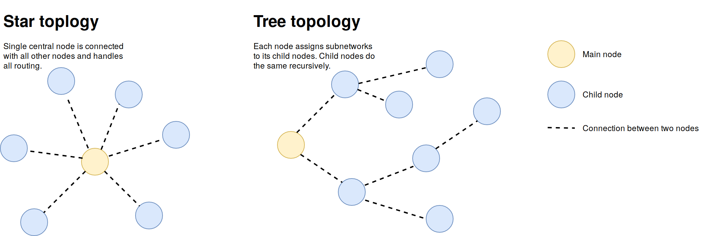
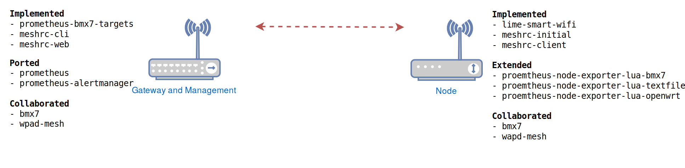
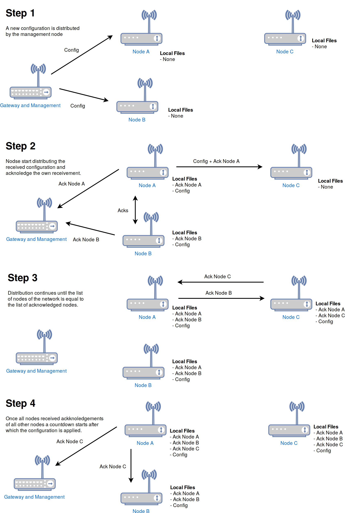
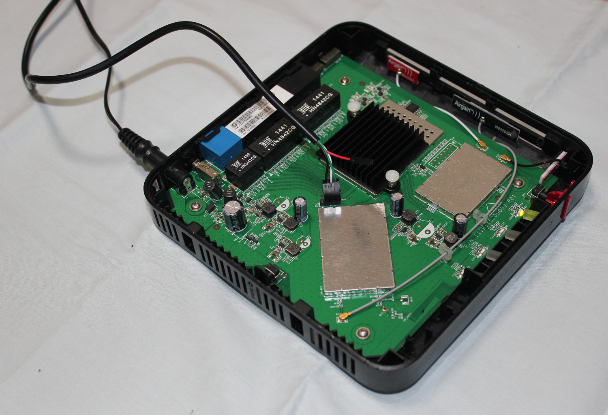
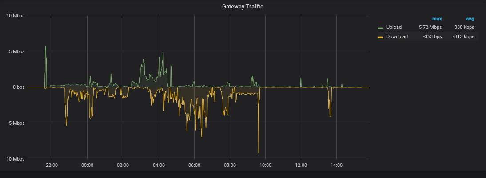

# Introduction

Due to the collaboration over the last two years with several Community Networks
I learned about the advances of mesh networks in contrast to statically
installed ones. During deployment of such networks I repeatedly realized the
absence of a toolset to simplify the setup and keep track of the network health.
In this work I implemented the missing tools and extended existing solutions to
be easily usable in real environments.

Community networks introduce additional challenges which exceed the focus of
this document. For that reason I decided to focus on use cases where all
hardware is owned by a single instance, simplifying the setup and lowering
security requirements. The tool created can nevertheless be used in community
networks, although this may require some additional modifications to follow
their decentralized requirements.

## Motivation

Creating a backbone network is a non trivial task. It requires experts to plan
the network topology ahead and define the way traffic network is routed  within
the network. Changes of the structure or optimization to prevent overload need
manual intervention. Manual setups may also lead to misconfiguration and cause
network downtimes. A more automated way could simplify the setup of backbone
networks possibly with mesh networks.

While for many years WiFi mesh networks have only been used by network activists
like Freifunk[^web_freifunk] or LibreMesh[^web_libremesh] the technology now
has been adopted even by big companies like Google Inc.[^google_mesh].

Having seen the mesh approach work in Community Networks[^qmp_barcelona] I
decided to make it usable for other use cases as well, allowing individuals
interested, which haven't touched this area yet, to deploy their own
decentralized backbone network.

[^web_freifunk]: https://freifunk.net/
[^web_libremesh]: https://libremesh.org/
[^google_mesh]: https://store.google.com/product/google_wifi_learn

## Aim

This work focuses on the simple initial setup, monitoring and configuration of a
backbone network which distributes an Internet uplink, setup and managed by a
central instance owning all nodes of the network.

This approach is not to be compared to tools and setups specialized on community
networks as exceedingly discussed in other works [@kos2015nodewatcher p. 4].
While parts of the implemented tools may be used in such a setup, the
centralized management is focused.

The outputs of this project are the following three parts:

* Node firmware which automatically integrates into the mesh network.
* A monitoring tool to check the usage and health of the network.
* A configuration tool to set basic properties of the network.

Different from existing approaches for monitoring and managing wireless
networks, no complex per device configuration is planned following the idea of
zero configuration, keeping all devices as generic as possible. Neither is any
longtime monitoring over several years implemented like for instance at
Guifi.net[^guifi_growmap]. This is due to this works focus on temporal
installations, where no such long time periods occur.

[^guifi_growmap]: https://guifi.net/en/guifi/menu/stats/growthmap

## Illustrative use case

To give a better idea of what the output of this work could be used for, below a
short description of a possible use case.

A winter market takes place yearly within the center of a city. For this event
small houses are built up and sell various goods. An electronic payment system
requires an Internet connection to verify payments. As thousands of mobile
devices with LTE arrive to the event, mobile telephony network may become
overloaded and the payment system could break down, if it would rely on it.
Instead, a number of WiFi access points could be created, where only authorized
payment devices can connect to. The mesh approach explained before could be used
in the following way, to allow the easy setup and spreading of APs. A small
number of vendors receive a pre configured mesh node and connect them to a power
plug. Active nodes connect with all other nodes in reach and offer an access
point at the same time. A special gateway node announces its direct Internet
connection to all active nodes, which then start using it.

If the winter market, due to unforeseen reasons, is shaped in a different way
than initially planed, the nodes connect dynamically, providing the same
functional backbone network. Additionally, if the winter market grows over the
initially planed area, a node is added and the access point coverage increases.
While the mesh approach could solve the growth and dynamic changes easily, a
classical static network likely requires manual, configuration per devices.

## Structure

This work is separated into sections starting from assessing requirements and
ends with a summary of the final product. In the section *project requirements*
\ref{project-requirements} specific needs of the works scope are explained. It
includes the sub-section *design decisions* \ref{design-decisions} elaborating
on used concepts and concrete realization - followed by section *implementation*
\ref{implementation} which covers technical details of used software and created
code. The last section *conclusion* \ref{conclusion} gives a summary of all work
done leading to fulfill the main objective.

Additionally provided are *attachments* \ref{attachments} which discuss hardware
and configurations used within this work.

## Related work

Previous to this work established solutions in the area of mesh networks were
reviewed to find a suitable starting point. The projects mentioned below are
community driven with a focus on community networks (CNs) [@vega2012topology
p.1]. While CNs are not focus of this work the software stack is open source and
can therefore be modified to fit the [projects
requirements](#project-requirements).

All below mentioned distribution or frameworks are based on OpenWrt and run on
regular home routers.

### Freifunk's Gluon

The Gluon software stack is broadly established in various states of
Germany^[https://multi.meshviewer.org/]. The software allows users to share
their Internet connectivity in two ways. Primary it is possible to offer
Internet connection (received by DSL or TV Cable) via an open AP to surrounding
neighbors. The traffic is routed over a community-owned VPN to avoid possible
lawsuits. Secondly the routers connect via wireless mesh with neighbored nodes
and share their uplink if existent, also vice versa.

To create the mesh network both *802.11s* and *ad hoc* are supported, for
routing the protocol B.A.T.M.A.N. Advanced[^batman_adv] is used.

[^batadv_scale]: https://trier.freifunk.net/2017/08/28/die-hoods-kommen/
[^gluon_monitoring]: https://develop.meshviewer.org/

### The Quick Mesh Project (qMp)

This distribution offers firmware images to setup a mesh network with minimal
manual intervention. The firmware automatically sets up all requirements to be
used in a mesh network and automatically connects to neighbors. If an Internet
upstream is announced by the mesh routing protocol, it automatically offers the
connection to connected clients. The project is actively used in the Barcelona
city area[^qmp_barcelona] with an active user base.

The firmware relies on the mesh routing protocol BMX6[^bmx6_github] and creates
the backbone mesh connection via *ad hoc* (in contrast to the newer *802.11s*
modes).

[^qmp_barcelona]: http://tomir.ac.upc.edu/qmpmon
[^bmx6_github]: https://github.com/bmx-routing/bmx6

### LibreMesh (LiMe)

LibreMesh is more a community driven framework than a distribution. Due to its
modularity it supports various use cases. It is possible to change activated
routing protocols, preinstalled software and IP addresses of subnets used. A
single configuration file[^lime_defaults] allows to control all WiFi, mesh and
network related settings.

Additionally it offers precompiled firmware images which work without any
further configuration. These images use a combination of *BMX6* and
*B.A.T.M.A.N*.

[^lime_defaults]: https://github.com/libremesh/lime-packages/blob/develop/packages/lime-system/files/etc/config/lime-defaults

The project is under active development and therefore offers a good starting
point to fulfill the requirements stated in section \ref{project-requirements}.

\newpage
# Basics concepts

This section aims to offer introducing knowledge of used technologies, covering
basics of wireless mesh networks, routing and dynamic routing protocols and
lastly the operating system for embedded devices OpenWrt.

## Physical connection between devices

Using cable or fiber connection between the nodes is optimal in terms of speed
but requires more work to setup. For the rapid deployment wireless connections
are preferred. This approach is broadly tested in various community
networks [@vega2012topology p. 2].

### Wireless access points

The most established setup for Wireless LAN or WiFi is an access point offering
a network to which clients may connect. This approach is found in nearly every
house with Internet access and many public places.  This setup is also usable to
provide uplink connectivity and is used by Wireless Internet Service Providers.
A fail of the access point results in connection loss between all connected
client nodes, even if they would be within line of sight.

### Wireless mesh

The WiFi standard *802.11s* (*11s*) [@hiertz2010ieee] offers the possibility that
two or more devices connect without the limits of a *client* and *access point*
setup.  All devices are connected equally, allowing continuous connectivity even
if single devices fail, as illustrated below. The *11s* WiFi mesh creates the
foundation of the backbone network discussed in this project.

Important to mention, the *11s* standard also introduces a routing protocol
which is deactivated in this project in favor of the routing protocol *BMX7*,
offering required features.


Figure \ref{backbone} shows an illustrative mesh network combining wireless mesh
connections with *11s* and APs. The red arrows stand for the backbone which is
handled by the dynamic routing protocol and transparent for connected clients.
Clients may connect via IP addresses to other clients within the mesh or use a
gateway node which offers uplink to the Internet.

## Routing of network traffic

A telecommunication network means the connection from any number of devices in a
way that they can communicate with each other. Nodes within the network require
routing information to forward or deliver packages to its receiver.

The following information is vastly simplified and has an exceeding explanation
in related works [@escrich2012quick p. 5].

### Classical network topologies

A network topology describes the connection design between nodes of a network.
Figure \ref{topology} pictures both star and tree topology.



This approach has the disadvantage that a node might move from one subnet to
another. Furthermore chaining of nodes is difficult as it requires previous
planning of subnetwork sizes.

### Dynamic routing protocol

The statically routed network described above can be set once and then work
without any additional daemons running on nodes of the network. To allow
dynamic changes of the network, like adding a new device, an active service has
to run on devices and react on changes. Dynamic routing protocols are active
components which automatically adapt the routing so that devices stay
reachable. The protocols use metrics to determine the link quality and choose
the fastest link to connect between devices.

This project takes advantage of the actively developed and constantly improved
mesh routing protocol *BMX7* [@neumann2017cooperation]. While there exist
multiple other dynamic and on mesh specialized routing protocols *BMX7* is
chosen for its integrated features covered in section \ref{design-decisions}.

## Operating systems for routers & network devices

Many home routers are able to run or are actually delivered with a very light
Linux operation system called OpenWrt[^openwrt_web]. It uses a modified Linux
kernel and has various optimizations to be usable on devices which often have
as little as 8MB of storage and 32MB of memory.

[^openwrt_web]: https://openwrt.org/

OpenWrt is comparable to other Linux distributions like Debian, but focused on
network related devices and embedded devices in general.

By default it can work as a wireless AP just usable as home routers do. However
it is possible to install mesh related packages via a package manager and
configure them depending on the required setup.

\newpage
# Project requirements

The following requirements and decisions regarding design are separated in node
and management specific lists. All items are based on my previous experiences
with the deployment and maintenance of mesh networks and advises from existing
Communities managing their own network.

Additional are aspects specially for this use case that cover the security of
the network which is normally not implemented in Community networks as they
use unencrypted connections between devices.

## Overall project requirements

Meta requirements that lead general design decisions \ref{design-decisions}.

* M1 **Reuse existing solutions:** Before implementing new software it should be
  tried to adapt to or extend existing solutions.

* M2 **Modularity:** While focused on the described use case, created software
  should be modular enough to be used in other scenarios as well.

## Requirements of the Mesh Firmware (N)

Covering the requirements of the software stack running on nodes.

* N1 **Zero-Conf Setup:** The initial setup of routers must work without
  per-device specific configuration, making it easy to rapidly deploy new
  devices.

* N2 **Encryption:** All wireless communication must be encrypted. Only devices
  authenticated with a password can enter the network.

* N3 **Frequency separation:** APs must run on a different frequency than the
  backbone mesh network to avoid connected clients to affect the backbone
  connection quality.

* N4 **Automatic device discovery:** New setup devices must automatically
  connect to the network and participate in the mesh network.

## Requirements of the management interface (I)

Covering the requirements of the monitoring and management interface for
administrative users.

Beneath the previously mentioned community collaboration the monitoring
interface is inspired by preceding work in this area
 [@centelles2015enhancing] [@cerda2013experimental] to build on previously
acquired knowledge of demands in mesh network monitoring.

* I1 **Limited access:** Only authorized users can see monitoring data or change
  the network configuration.

* I2 **Simple setup:** No complex dependencies and no complex manual setup must
  be required to install the management interface, allowing non technical users
  to setup their own network.

* I3 **Network graph:** A graph showing all mesh-nodes of the network and the
  connection quality between them. This visualizes the network and helps to spot
  bottlenecks and malfunctioning devices.

* I4 **Automatic monitoring:** New mesh-nodes must be automatically added to
  monitoring and management interface, allowing configuration and status checks.

* I5 **Alerts:** In case of device failures or overloads the network
  administrators must automatically receive a warning.

* I6 **Network configuration:** The interface must allow the configuration of
  basic parameters of the network, like Access Point names (SSID) and passwords.

## State of current mesh distributions

In this subsection some key limitations of the mesh distributions above
described are mentioned and thereby the choice for *LibreMesh* will be
explained.

### Gluon

* **req. I2** Gluon offers a very sophisticated monitoring system
  [^gluon_monitoring] which exceeds the scope of this work. However it worked as
  a good inspirational source for the herewith created interface.

* **req. N1** Nodes are individually configured and use manually selected IP
  addresses^[https://config.berlin.freifunk.net/wizard/routers].

* While it is not a primary goal of this work to be highly scaleable, it is
  reasonable to offer greater numbers of access points to cover large areas.
  However using *B.A.T.M.A.N.* as mesh routing protocols comes with limitations
  in terms of scalability and thereby requires additional configuration around
  this issue[^batadv_scale].

### qMp

* **req. N2** The final firmware is required to offer encrypted wireless
  connection between nodes and clients but also between nodes. This isn't
  possible for *ad hoc* mode and only available via *802.11s*. In recent
  development versions of *qMp* support for *802.11s* was added[^qmp_80211s] for
  testing but long after the decision to use *LibreMesh* as a base.

* **req. I3** Work was done for a monitoring system but never became fully
  integrated in the *qMp* [@centelles2015enhancing]. The scope of the monitoring
  system was also different as it was implemented in a decentralized way.

\newpage

### LibreMesh

* *LibreMesh* did not offer any monitoring possibilities apart from a very
  rudimentary network graph offered by the `luci-app-bmx6`[^luci-app-bmx6]
  package.

* **req. I6** With a package called `first-boot-wizard`[^fbw] it is possible to
  distribute the initial configuration file called `lime-defaults` to other,
  unconfigured nodes within read. While this approach works for an initial setup
  it does not allow continuous changes nor distribution of settings outside the
  `lime-defaults` file, like SSH keys.

[^fbw]: https://github.com/libremesh/FirstBootWizard
[^luci-app-bmx6]: https://github.com/openwrt-routing/packages/tree/master/luci-app-bmx6
[^qmp_80211s]: dev.qmp.cat/projects/qmp/repository/revisions/003700f24b3859836644425de4f30c773bf6acca

| req. ID | Feature / Requirement         | Gluon     | qMp   | LibreMesh |
| ---     | ---                           | ---       | ---   | ---       |
|         | **Node**                      |           |       |           |
| N1      | Zero-Conf Setup               | N         | Y     | E         |
| N2      | Encryption                    | N         | N     | E         |
| N3      | Frequency separation          | N         | Y     | I         |
| N4      | Automatic device discovery    | N         | Y     | E         |
|         | **Management interface**      |           |       |           |
| I1      | Limited Access                | N         | N     | I         |
| I2      | Simple setup                  | N         | N     | I         |
| I3      | Network graph                 | Y         | N     | I         |
| I4      | Automatic monitoring          | N         | N     | I         |
| I5      | Alerts                        | U         | N     | I         |
| I6      | Network configuration         | N         | N     | I         |

Table: **Mesh distribution features:** *[Y]* exists, *[N]* missing, *[U]* unknown,
*[E]* extended within this work, *[I]* implemented within this work.

## Design decisions

This sections cover the output of this work and explains how the previous stated
[project requirements] were fulfilled. The content is focused on fundamentals
and basic concepts and less technical than the following section covering the
concrete [implementation].

### BMX7 as routing protocol

While there exists various mesh routing protocols like Batman
Advanced[^batman_adv], OLSR [@jacquet2003optimized] and
Babel [@chroboczek2011babel], three main reasons led this project to use *BMX7*.

* It is predecessor *BMX6* is the main routing protocol of qMp [@escrich2012quick
  p. 23] and LibreMesh both were used as a main source of inspiration.
* *BMX6* was evaluated to likely show better scaling and overall performance
  then the competitors Babel and OLSR [@baig2012evaluation pp. 53-54].
* It offers various plugins avoiding to re-implement required
  features^[https://github.com/bmx-routing/bmx7#bmx7-plugins].

### Monitoring

To maintain a stable mesh network it is crucial to know key live information of
the devices. This can be done by a monitoring system obtaining data from nodes
and presenting them in an easily readable fashion.

#### Required data

It has to be distinguished between *device* and *network structure*. The
combination of both enables network administrators to quickly check the health
of the network and find bottlenecks.

##### Monitoring of nodes

The collected metrics must allow the administrator to easily recognize device
malfunction and give an overview of the running network. The *per device*
monitoring therefore contains the following data:

* CPU load
* Free memory
* Traffic of AP and mesh
* Number of connected clients
* Firmware version
* Device hardware

#### Network structure and quality graph

Next to individual device data it is useful to track the connectivity between
nodes allowing an optimization, following the idea of *If you can't measure it,
you can't improve it*. It must be possible to check the health of links and the
estimated maximal achievable bandwidth between devices, all in an easily
readable graph.

Required information about the structure are therefore:

* List of nodes
* Connection between nodes (links)
* Estimated bandwidth of link
* Used interface for connection (Cable or WiFi)

#### Monitoring backend

A monitoring backend must be capable of efficiently storing metrics and offer
a convenient API to extract the data. Newly added nodes must appear
automatically in the monitoring system without any manual intervention. Also
metrics are *pulled* from the nodes by the monitoring instance rather
than *pushed* from the node to the backend. The *pull* approach offers various
advantages for this setup:

* Easily setup multiple monitoring instances for redundancy.
* Migration to a new monitoring machine does not require any node configuration.
* Even with a higher number of nodes, the monitoring backend won't be overloaded
  by to many incoming metrics pushed by nodes. The backend decides on its own
  when to collect metrics from nodes.
* Let the backend decide which metrics are of interest instead of receiving all
  possible metrics available[^collect].

This project will not cover a comparison between monitoring engines so an
established and easy to setup solution is chosen: Prometheus[^prometheusio]. It
offers the required backend to scrape nodes, store the data and offer them via
an API[^prometheus_api] or various web interfaces like Grafana[^grafana].

[^prometheus_package]: https://github.com/openwrt/packages/pull/5903
[^prom_service]: https://prometheus.io/docs/prometheus/latest/configuration/configuration/
[^prom_bmx7]: https://github.com/aparcar/meshrc/tree/master/packages/prometheus-bmx7-targets
[^prometheusio]: https://prometheus.io
[^prometheus_api]: https://prometheus.io/docs/prometheus/latest/querying/api/
[^grafana]: https://prometheus.io/docs/visualization/grafana/
[^node_exporter_lua]: https://github.com/openwrt/packages/tree/master/utils/prometheus-node-exporter-lua
[^collect]: https://github.com/prometheus/node_exporter/#filtering-enabled-collectors

#### Monitoring web interface


The web interface requires an authentication to only allow administrators to
view stats and change the configuration. Instead of implementing an individual
authentication it is taking advantage of OpenWrt micro Bus system called *ubus*
[^ubus] which manages user login. The password entered in fig. \ref{login} is
send to *ubus* via the *uhttpd-mod-ubus*[^uhttpd-mod] package which allows Bus
communication over HTTP(S).

[^uhttpd-mod]: https://openwrt.org/packages/pkgdata/uhttpd-mod-ubus


Figure \ref{graph} shows a test-bed where a total number of 11 nodes are
deployed. All nodes are running the *prometheus-node-exporter-lua* script with
the mentioned *BMX7* plugin to show their active links. Most connections work
fine and are estimated with more than 50Mbit/s bandwidth. Connections with
higher throughput are colored in purple and are likely by cable.

Additionally, the node *liebmann92-m5* has currently high load and is shown in
orange. This likely happens due to the use of weak hardware, not fulfilling the
minimal requirements described below, a malfunctioning application or script
causes the high load. The viewer can easily spot where further manual inspection
is required. Both nodes *rhizomia-buero* and *rhizomia-link* are currently down
and no data can be obtained. Nodes that provide uplink connectivity (gateways)
are marked with a purple border around the dot, helping the viewer to understand
the network flow.


Figure \ref{overview} shows a table with additional information about all
devices. All data monitored can be added to this table. The exact metrics of
interest should be evaluated in further practical tests and exceeds the scope of
this work.


Finally the top right corner of fig. \ref{overview-24h} is a drop-down menu
allowing to see previous states of the network, various values between 2 minutes
and 24 hours. In this test-bed some nodes were down 24 hours ago.

### Configuration tool

The mesh configuration is limited to a very basic set of options to allow only
surfacing settings to be changed, protecting non technical users from breaking
the network. As mentioned in the project requirements above, the network must be
self configuring as much as possible.

#### User interface for configuration

Figure \ref{config} shows that the basic configuration interface only allows to
change the *mesh password* which is used for the mesh backbone connection and
the *access point password* which is used for clients. Distribution of initial
configuration can be disabled via the top left checkbox and additional SSH keys
for remote access can be set.


Also, the red *reset* button will flush all configuration on all nodes. This is
useful to bring all nodes back in a mode where they try to fetch a configuration
via a *link local* connection [@rfc42912006version p. 11]. Further details about
this are described below in the section *meshrc-initial*
\ref{initial-configuration-retrieving}. Additionally, as shown in fig.
\ref{node} it is possible to set individual settings per node, regarding the
nodes *host-name* and it is *access point name*.


#### Distribution of new configurations

Instead of implementing a new tool to distribute data over a mesh network,
requiring also a secure way for authentication, I chose to use the existing
solution called *bmx7-sms*[^bmx7-sms]. It solves the two requirements needed:

* Distribute commands or configuration files to all nodes of the mesh network.
* Add authentication layer to allow nodes verifying the received command or
  configuration is legitimate.

All nodes of a *BMX7* based mesh network have a unique identification[^bmx7-id]
which is based on a public key pair created on first boot. All
descriptions[^bmx7-descriptions] are signed by the nodes and so are the messages
distributed by the *bmx7-sms* plugin [@neumann2016securely].

Badly signed messages are not accepted by nodes and thereby not distributed nor
processed. Received messages are stored in a file system containing the sending
nodes ID. Thereby it is easy to check legitimate commands by controlling if the
name of the received file starts with the ID of a trusted node.

An additional point of consideration is the question on how to deal with
connection breaking changes. Meaning, if for instance the *mesh password* is
changed, nodes further distanced from the initial sending nodes can no longer
communicate and thereby not receive the new password. To address this problem I
implemented a function to wait until the cloud is successfully synced.

[^bmx7-sms]: https://github.com/bmx-routing/bmx7#sms-plugin
[^bmx7-id]: https://github.com/bmx-routing/bmx7#global-id
[^bmx7-descriptions]: https://github.com/bmx-routing/bmx7#descriptions

### Initial firmware creation

Nearly all router models require individual firmware images due to different
specifics like used CPU architecture and available hardware
components[^openwrt_toh]. Instead of creating preconfigured images for a
specific setup, there is an *initial firmware* which has all required packages
preinstalled and a generic configuration (\ref{lime_defaults}) with disabled
wireless radios for security reasons.

Obtaining the firmware can be achieved by using an online tool like Chef[^chef]
or setting up a local OpenWrt build environment[^openwrt_buildroot].

The section below covers the topic how a specific configuration is applied.

[^openwrt_buildroot]: https://openwrt.org/docs/guide-developer/build-system/install-buildsystem
[^chef]: https://chef.libremesh.org

### Initial configuration

Changing settings in the web interface results in the creation or update of an
archive containing all configuration files. OpenWrt already uses this approach
to backup and restore configured routers[^gh_openwrt_restore].
The very same approach is performed for initial node configuration in the
following way.

A daemon running on the *initial firmware* checks if the node is already
configured. If not, it tries to download the node configuration archive from all
devices connected via link local. The idea behind that is, after a flash with
the plain *initial firmware* image, the device just needs to be connected via
cable to the gateway node and will automatically configure itself.

This allows to use a firmware image only containing a generic `lime-defaults`
configuration file \ref{lime_defaults}. A reset of the router will remove all
configurations and restart the daemon looking for an applicable configuration.

[^gh_openwrt_restore]: https://github.com/openwrt/luci/blob/master/modules/luci-mod-admin-mini/luasrc/controller/mini/system.lua#L18

\newpage
# Implementation

This section covers technical details on how the previously stated requirements
are implemented. As stated in req. M1 as overall paradigm it was tried to avoid
re-implementing existing software and rather combine present tools to fulfill
the task in a simple way.

All source code is published on GitHub.com in the `meshrc` repository
^[https://github.com/aparcar/meshrc] and in the official OpenWrt upstream
packages ^[https://github.com/openwrt/packages/].

Figure \ref{toolstack} gives an overview of all implemented, ported and
extended tools and their position within the mesh network.



## Administrative backend

To allow portability on different operating systems and easy extension
without the need to be extremely performant[^performant], the web interface and
it is components are written in Python3, Shell, and JavaScript.

[^performant]: The code was design to never exceed $O(n)$, where $n$ is the
number of nodes. Time measurements were done with up to 100 virtual nodes
resulting in response time of a few milliseconds.

### Web interface & authentication via UBUS

The web interface was initially planned to use the Python Web Framework
Flask^[http://flask.pocoo.org/] but was quickly replaced for pure JavaScript and
the use of OpenWrts ubus[^ubus] to minimize library dependencies and therefore
storage footprint. Also the use of a full grown JavaScript framework to generate
the web interface, apart from the graph creation, was decided against. The
current implementation is done using only basic JavaScript function and contains
in total less than 450 lines of code. To be usable on a mobile phones Twitters
Bootstrap[^web_bootstrap] is used for styling which also offers a responsive
design for mobile administration.

All web interface functionality is guarded by *UBUS*, meaning only after a
successful authentication it is possible to receive collected monitoring data or
execute configuration commands. This follows *req. M1* as no additional
authentication stack is implemented. After a successful login *UBUS* returns a
token which is attached to every request by the web interface. It automatically
times out five minutes after the last usage.

Receiving JSON data via *UBUS* simplifies the implementation as the front-end
part is entirely written in JavaScript without additional server side code. This
brings the advantage that all rendering is performed on the viewing devices
instead of the server, therefore it is also easier to scale if parts of the
monitoring data should be accessible to clients without authentication.

Figure \ref{seq_show_netjson} illustrates the login sequence and communication
between web interface and the backend which creates the JSON data. This and the
following sequence diagram only handles the case that the provided password was
correct. In case of bad input an error is returned by *UBUS*, brute force
attacks are handled equally to UNIX logins, with delayed responses.


[^ubus]: https://openwrt.org/docs/techref/ubus

Just as for receiving monitoring data an authentication is required to change
any configuration. Again *UBUS* is used, meaning a successful login allows
seamlessly switching between checking monitoring data and applying
configurations, as the *UBUS* token works for both functionalities. The use of
*UBUS* for the configuration is shown in fig. \ref{seq_change_mesh_pw}.


#### Obtaining data from nodes

To fulfill *req I7* all nodes require a running service to parse local device
metrics and offer them in the Prometheus format[^prom_format]. This can be
achieved using an active service running on each nodes which parses device
information from places like `/proc/` and expose them on a specified port via
HTTP.

The tool `prometheus-node-exporter-lua` is a LUA re-implementation of the
official Prometheus `node_exporter`[^prom_exporter] and offers such
functionality compatible with Prometheus.

While the tool already works for device metrics, some key information are
missing to make it usable for this work. Following *req. M1* the script was
extended with additional export capabilities:

* `prometheus-node-exporter-lua-openwrt`[^pr_6007]: Exports installed firmware
  version and hardware model to spot outdated devices within the monitor and
  have an overview of used hardware.

[^pr_6007]: https://github.com/openwrt/packages/pull/6007

[^prom_exporter]: https://github.com/prometheus/node_exporter

* `prometheus-node-exporter-lua-bmx7`[^pr_bmx7_exporter]: While per device
metrics are a standard requirement for monitoring, this work needed a way to
monitor the network structure as well. The created *BMX7* plugin uses the
routing protocols JSON output stored in `/var/run/bmx7/json/` to export
connections and resource usage of the routing service. This allows to view
network development over time, how link quality changes and CPU and memory
increase during network growth.

* `prometheus-node-exporter-lua-textfile`[^prom_textfile]: Additionally a plugin
was created to generically export metrics from bash scripts or static text
files. This allows to monitor further metrics like node owner, sensor data or
device locations.

[^prom_format]: https://prometheus.io/docs/instrumenting/exposition_formats/
[^lua]: https://www.lua.org/
[^pr_bmx7_exporter]: https://github.com/openwrt/packages/pull/5578
[^prom_textfile]: https://github.com/openwrt/packages/pull/5894

All changes were accepted upstream and all plugins are independently  available
in the official package repository of OpenWrt, following *req. M1* and *req.
M2*.

#### Radio frequency separation

To avoid user traffic interfering with the backbone connection those frequencies
should be separated (*req. N3*) to 2.4GHz for access points and 5GHz for mesh.
This feature was not available in the LibreMesh framework so an additional
package was created called `lime-smart-wifi`[^lime-smart-wifi].

It scans for all attached wireless radio transmitters and checks their
capabilities (supported frequencies, transmission power and channel bandwidth).
With a simple heuristic approach it assigns roles to radio devices:

* **single band:** AP and mesh share the same radio.
* **dual band:** AP runs on 2.4GHz and mesh on 5GHz.
* **tri band:** like dual band but additional AP on 5GHz with different channel.
* **quad band:** dual AP and mesh each on different frequency and channel.

The tool chooses channels with maximum distance for minimal interference.

During the creation of this project the *hostapd*[^hostapd_web] daemon did not
support to run an encrypted mesh and an encrypted AP on the same radio.
Therefore the package is also required to obey *req. N2*.

As the package has no dependencies apart from the LibreMesh framework it is
usable independently of this works software stack (*req M2*).

#### Porting Prometheus to OpenWrt Buildroot

To allow an easy installation (*req. I2*) of Prometheus on OpenWrt an
architecture specific package is required.

The OpenWrt operating system manages all packages in a public Git repository. It
stores per package a Makefile containing all information required for creation.
So called Buildbots automatically download the git repositories and containing
Makefiles and compile the packages, resulting in the official package
feeds[^owrt_packages]. It is important that code is cross compiled which means
to be compiled on a different architecture than eventually run. This is
necessary as most routing devices use other architectures than
x86[^openwrt_toh].

OpenWrt Buildroot can compile various programming languages to run on targeted
devices. The support for Go[^golang] was added in May 2018[^np_go] and so allows
porting Prometheus to OpenWrt.

[^golang]: https://golang.org/
[^np_go]: https://github.com/openwrt/packages/pull/5780

Therefore the Prometheus package was ported within this
project[^prometheus_package]. It required to understand the newly introduced
features of OpenWrt's Buildroot to be compatible with the Buildbots (*req. 1*).

[^owrt_packages]: https://downloads.openwrt.org/snapshots/packages/

#### Network visualization with NetJson

Looking for tools to visualize network graphs, especially in the field of mesh
networks, the only viable tool was NetjsonGraph.js [^gh_netjsonjs]. The graph
framework uses the data format NetJson^[https://netjson.org] as input data and
shows an interactive graph with additional metrics, zooming and dragging
capabilities.

NetJson is a format designed for network statistics. It also allows the handling
of connections between devices[^netjson_links] which are then visualized by
NetjsonGraph.js.

As written earlier within the design decisions \ref{design-decisions},
Prometheus is used for device monitoring. While it offers an API to read stored
metrics, the file format is insufficiently to directly use it as input for a
bidirectional graph.

For this work the tool Prometheus2NetJson (*p2n*)[^p2n] was created. It outputs
valid NetJson containing all nodes with collected metrics as well as all links
and their quality. On execution *p2n* connects to a configured Prometheus
instance and performs various API requests to collect all desired data. The
received metrics are then merged into a single NetJson file. Next, the output is
used by NetjsonGraph.js[^graph_netjson] and the overview table.

To show the link quality between devices the NetjsonGraph.js framework
was extended to colorize the edge connection nodes depending on estimated
throughput[^graph_quality].

Additionally *p2n* can take a time input as relative time delta, specific time
in the Unix time stamp format or following RFC3339 [@klyne2002rfc]. This enables
to create NetJson of any time in the past, allowing to visualize development of
the network.

For the overview page the generated NetJson is interpreted and visualized in a
table. The visualization of the graph and table is done in both cases via
JavaScript relieving the monitoring node from render the actual output. This
implementation allows a modular use of the  interface even for other NetJson
files not produced by *p2n*.

[^gh_netjsonjs]: https://github.com/netjson/netjsongraph.js
[^netjson_links]: http://netjson.org/#third/1
[^p2n]: https://github.com/aparcar/meshrc/blob/master/packages/meshrc/files/web/usr/bin/p2n
[^graph_quality]: https://github.com/aparcar/meshrc/blob/master/packages/meshrc/files/web/www/meshrc/static/css/netjsongraph-theme.css#L196
[^graph_netjson]: https://github.com/aparcar/meshrc/blob/master/meshrc/templates/graph.html#L102
[^web_bootstrap]: https://getbootstrap.com/

#### Automatic monitoring of new nodes

Prometheus supports various ways for service discovery[^prom_service] meaning to
automatically add monitored targets after creation. Until now there was no
solution for automatically monitoring (*req. I4*) of all devices of a mesh
network based on the routing protocol *BMX7*. The package
`prometheus-bmx7-targets`[^prom_targets] was created to automatically add *BMX7*
nodes to a file readable by the Prometheus instance[^prom_bmx7]. A minimal
configuration for Prometheus is attached below in \ref{prom_config}.

[^prom_targets]: https://github.com/aparcar/meshrc/tree/master/packages/prometheus-bmx7-targets

To work the `bmx7-json` plugin[^bmx7-json] is enabled which creates JSON files
containing status information of the running *BMX7* daemon. The created tool
monitors changes via `inotifywait`^[https://linux.die.net/man/1/inotifywait].
Concretely it scans the folder `/var/run/bmx7/json/originators/` where status
information of all *BMX7* nodes of the network are stored. The wait command
blocks until a file (node) is added or removed. Once unblocked, the output file
containing Prometheus targets is updated and `inotifywait` blocks again until
another change of connected nodes happens[^prom-bmx7-targets]. Prometheus
detects changes to the target file automatically and starts scraping new
entries.

[^prom-bmx7-targets]: https://github.com/aparcar/meshrc/blob/master/packages/prometheus-bmx7-targets/files/usr/bin/prometheus-bmx7-targets
[^bmx7-json]: https://github.com/bmx-routing/bmx7#json-plugin

#### Synchronize cloud via `cloud sync`

When changing connection disruptive commands like change of the mesh ID or key,
it is important to happen on all nodes at the same time. If a single node misses
the new configuration it is lost with outdated configurations, no longer being
able to connect.

The current implementation distributes a *SMS* of the form
`<received_command>-ack` to all other nodes, stating its acknowledgement of the
command. On receiving an `ack` from another node, the node compares the list of
known nodes with the list of received acknowledgments. Once both lists are
equal the node executes the received command. This process is illustrated in
fig. \ref{cloud_sync}.



## Initial configuration retrieving

To distribute the *initial configuration* the gateway node has to install
*meshrc-web*. Changing settings in the web interface sends the configuration to
connected nodes and also updates a locally stored archive containing these
settings and offer it via a web server to directly connected devices.

Unconfigured nodes try to find all directly connected neighbors of the *LAN*
bridge (`br-lan`). It is scanned via an IPv6 broadcast ping^[`ping6 -I br-lan
ff02::1`]. The *meshrc-initial* daemon tries to download a file called
*config.tar.gz* from all found neighbors. In case the config archive was
downloaded successfully, it is extracted to the devices file system root and a
reboot performed after which all settings are activated.

As the `link-local` address [@hinden2006ip pp. 11] is used only directly
connected nodes can download the archive and no regular IP addresses are
required. This implementation prevents external parties from accessing the
archive containing passwords only making it accessible to users which have
hardware access to the gateway node.

## Usage of `bmx7-sms` plugin for configuration

All nodes setup with the *initial configuration* automatically trust the *BMX7*
ID of the node they received the configuration from.

An ID could look like `F28A940935AA41D9019476FB397913CB45D798B593AD45544DBDC33A`
which is the SHA224 hash of the nodes public key.

Files distributed via the `bmx7-sms` plugin are prefixed with this ID, so a file
`mesh` becomes 
\newline
`F28A940935AA41D9019476FB397913CB45D798B593AD45544DBDC33A:mesh` and is stored on
all other nodes in `/var/run/bmx7/sms/rcvdSms/`. If a node tries to fake the ID
of another (maybe known to be trusted) node the spoof will fail due to the fact
that the faking node is not in possession of the real node's private key, which
is required to sign the distributed file. Badly signed files are deleted by
surrounding nodes and not further distributed to the mesh.

It is trivial to scan the previously mentioned folder for files starting with one
of the *trusted* IDs. In case of a match, the file name and content is examined
and processed.

The following list shows all supported commands distributed as file. The file
content is used as value for the command. It distinguishes between two filename
prefixes for LibreMesh specific commands `lm-*` and raw commands `rc-*`. The
former only change the framework file `/etc/config/lime` and applies the changes
via `lime-config && lime-apply` while the latter run the command directly on the
node.

Currently the following list of functions is implemented:

* `lm-hn_<short_id>`: Set Hostname of specific node with `<short_id>`.
* `lm-mk`: Set the mesh password (key) used by the backbone network.
* `lm-mi`: Set the mesh ID used by the backbone network.
* `lm-ak`: Set nodes access point password (key).
* `rc-rst`: Resets nodes to the state of the *initial firmware*.
* `rc-ssh`: Set the ssh keys allowed to login as root.

For all of the above commands it is possible to append `_<short_id>` to the
filename so it is only executed on the specific node. Notable that changing the
Mesh ID or key of a single node would result in connection loss.

As of commit
`9883383`^[https://github.com/bmx-routing/bmx7/blob/9883383dc26df16da67b9ef7ba99efe62f79c4e7/lib/bmx7_sms/sms.h#L25]
the `bmx7-sms` plugin only supports filenames up to a length of 16 characters.
This can result in confusion if implementing own commands.

## IP address collision avoidance

Following *req. N1* all nodes must automatically choose a IPv4 subnetwork from
which they offers addresses to connecting clients. The IPv4 addresses must not
overlap as the routing protocol wouldn't know which node handles the subnetwork.
Per
default^[https://github.com/libremesh/lime-packages/blob/develop/packages/lime-system/files/usr/lib/lua/lime/network.lua#L41]
LibreMesh tries to avoid IP collision by picking pseudo random data, like the
MD5 hash of the used AP name. While this works, the devices IP address changes
every time the AP name changes. To avoid this, an additional parameter, which
uses a MD5 hash of the primary MAC address, was implemented for this project.
This results in an equally small chance of collision but keeps a static address
for each device. The
changes^[https://github.com/libremesh/lime-packages/pull/349] were accepted
upstream.

The attached `lime-defaults` configuration file \ref{lime_defaults} uses `10.%m1.%m2.1/24` which
results in a collision probability of $n/(256^2)$ where $n$ is the number of
used nodes.

## Alerts in case of malfunction

Adding alert support when using Prometheus is fairly trivial. The attached
configuration file \ref{prom_rules} sends an alert in the following three cases:

* `node_down`: A previously connected node is offline for more than 10 minutes.
	* Indicating device failure.
* `node_high_load`: The average load of the last 15 minutes is over 1.0.
	* Indicating a bottleneck or software malfunction.
* `link_bad_quality`: Estimated link quality between two nodes is under 10Mbit
  for 10 minutes.
  	* Indicating an obstacle may started to block direct line of sight or
	  antenna malfunction.

The alert system can use any metric collected by Prometheus and so can easily be
extended to custom needs[^prom_alert_config] in other use cases (*req. M2*).

[^prom_alert_config]: https://prometheus.io/docs/alerting/configuration/

\newpage
# Collaboration

This work exists due to the collaboration with multiple individuals and
communities working on various aspects in the area of mesh technologies.
Instead of reinventing existing solutions for the initially described project
requirements, I decided to evaluate established approaches and extend their
functionality if possible to fit the stated needs.

## LibreMesh extension and fixing

As explained before in the section design decisions \ref{design-decisions} I
worked in various areas[^gh_lime_aparcar] of LibreMesh[^libremesh_website] and
added multiple features or fixed existing bugs.

The most important bug fix regarding this project was the fixing of interface
detection of *BMX7*^[https://github.com/libremesh/lime-packages/issues/335]. To
successfully estimate the possible bandwidth of a network interface *BMX7* has
to know about the nature of the interface (cable or wireless). Before the fixing
patch [^gh_interface_patch] all wireless interfaces would be interpreted as a
cable and wrongly diagnosed with full Gigabit bandwidth making monitoring of
link quality useless.

[^gh_interface_patch]: https://github.com/bmx-routing/bmx7/pull/12

## Encrypted mesh networks

Started with an issue on GitHub[^gh_crypt_mesh] regarding an encrypted mesh
network the OpenWrt core developer Daniel Golle[^gh_dango] and me started to
investigate the problem together. With various tests and bug fixes in an
especially for this issue setup test-bed, we eventually created a working
version and closed the initial issue. This also showed the path for the backbone
encryption of this project.

[^gh_crypt_mesh]: https://github.com/libremesh/lime-packages/issues/208
[^gh_dango]: https://github.com/openwrt/openwrt/commits?author=dangowrt

## Working at the UPC Barcelona

During my exchange semester in Barcelona I could highly benefit from the
collaboration with the network laboratory at the UPC[^upc_web]. Thanks to it is
members I could setup a test-bed to evaluate initial ideas for the
implementation. Also I could discuss there various features and drawbacks of
LibreMesh and the Quick Mesh Project[^qmp_web].

Members of the community project Guifi.net[^guifi_web] offered insights in their
mesh setups and I had the chance to discuss various requirements for a useful
monitoring solution. Furthermore I got the chance to run the software created
within this project on various networks to have a more complex test-bed.

[^gh_lime_aparcar]: https://github.com/libremesh/lime-packages/commits?author=aparcar
[^libremesh_website]: https://libremesh.org
[^upc_web]: https://upc.edu
[^qmp_web]: https://qmp.cat
[^guifi_web]: https://guifi.net
[^lime-smart-wifi]: https://github.com/libremesh/lime-packages/pull/321
[^hostapd_web]: https://w1.fi/
[^dfs]: http://wifi-insider.com/wlan/dfs.htm

\newpage
# Evaluation

After implementing an initial prototype of the software stack it was iteratively
evaluated and checked for functionality. This section consists of two parts, the
summary of the monitoring and the management part.

The former was tested within an actively used mesh network while the latter
could only be tested in a test-bed with perfect conditions due to the lack of
hardware and location changes.

## Monitoring evaluation

In various parts of Leipzig exists mesh infrastructure handled by
Freifunk[^ff_leipzig] and a wireless internet service provider[^reudnetz]. The
monitoring system  was installed on parts of this infrastructure as it is not
putting the devices connectivity at risk. It merely requires adding the read
only exporter per device. The underlying mesh routing protocol used in the
network was already *BMX7*, so no additional configuration was required.

The figures \ref{graph}, \ref{overview} and \ref{overview-24h} are screenshots
of the *meshrc* interface running in the previously described network. Collected
data is consistent with manually gathered information, therefore the output can
be considered valid.

As fig. \ref{overview} shows the network consists of various devices, partly
used for the backbone connections (*Loco M XW* and *Nanostation M XW*), access
points (*TL-WDR3600*) or both (*ZBT-WG3426*).  Devices are connected as shown in
fig. \ref{graph} where backbone distances vary between 100 and 2000 meters.

This shows a shortcoming of the current monitoring approach as the distances
between devices are not visualized. The metric is not available and so could not
be implemented. However a future version of the monitoring view could be
extended to handle the metric if available or calculate distances based on
locations provided by a static file containing location coordinates.

While setting up the monitoring system a high load on node *liebmann92-m5* was
discovered and investigated. A bug of the LibreMesh firmware caused on that
device the constant crash and reload of a service, resulting in high CPU usage.
The malfunction later was fixed normalizing the load. A case like this document
the need for an active monitoring system.

### Resource requirements for monitoring


Figure \ref{htop} shows the low resource footprint of the running Prometheus
instance. As shown, it uses less than 20% of the 240 MByte available memory,
meaning under 50 MByte for the Prometheus process. This allows to use small
embedded devices like the Raspberry Pi [^rpibplus] to act as the monitoring node
and does not require a real server setup.

This value was captured with only a single instance of the monitoring web
interface opened and only 11 nodes participating in the network. Further
research has to show the resource usage of the Prometheus process in a growing
mesh network. Fortunately Prometheus offers to monitor its own resource usage as
well, allowing to easily compare it to the  number of monitored nodes.

Beneath the monitoring service the data is aggregated by the *p2n* script which
runtime naturally increases with the number of nodes. It is designed to run in
$O(n)$ and should therefore be scaleable with higher numbers of nodes.

A test with the test-bed described above however showed an unexpected long time
for the NetJson creation.

```bash
root@rdntz-gateway:~# time p2n > /dev/null
real    0m 0.51s
user    0m 0.45s
sys     0m 0.02s
```

In the current implementation of *p2n* all metrics are serially retrieved which
is performed via a `localhost` HTTP API request. Establishing the connection
does significantly slow down the response, meaning more nodes would affect
response time less than additional metrics. One could gather all metrics in
parallel and use additional caching to stop unnecessary recreation of the
NetJson output.

[^rpibplus]: https://www.raspberrypi.org/products/raspberry-pi-3-model-b-plus/

[^ff_leipzig]: https://leipzig.freifunk.net
[^reudnetz]: https://reudnetz.org

## Management evaluation

Due to a location change and the fact that the mesh network in Leipzig was
actively in use, it was not feasible to test and improve the management part
there. For that reason a small test-bed was created allowing the evaluation of
the control instance. It consisted of the previously mentioned **Raspberry
Pi**[^rpibplus] (Pi) and three **Buffalo WSR-1166DHP** routers. The *Pi* was
used to monitor and control the network while the routers formed a partly wired
and partly wireless mesh network. Hardware choice was made based on availability
in Tokyo, Japan, low price and compatibility with Prometheus, OpenWrt and the
*802.11s* mesh mode.


The test-bed was setup as illustrated in fig. \ref{mgmt-testbed}, with distances
of only a few meters. As the *Pi* features only a single LAN port it is not
suitable as a gateway. As a replacement one of the nodes was used as gateway
which is seamlessly possible due to LibreMesh's automatic configuration. Due to
the combination of wireless and wired combination the distance between the
management node *Pi* and the last *Buffalo* node connected to the Internet has
as many hops (nodes in between) as possible, which gives a slightly more
realistic test-bed.

### Initial node setup

Firstly the initial configuration (*req. N1*) via the package `meshrc-initial`
was tested. A generic image was created which would not setup any wireless
connections, instead searching for a node connected via cable to retrieve an
initial configuration. This step worked flawlessly as once a node was connected
to the *Pi* it instantly downloaded the configuration, applied it and rebooted.
The reboot let routers LED's flash which signals implying configuration
retrieval was successful.

\newpage
\lstinputlisting[caption=Example of initial config download.]{flash.txt}

Below log paste shows how a node finds two neighbors (MAC addresses substituted)
and tries to download the configuration. The second node is the *Pi*. All three
devices are connected via cable.

Changing option in the management interface fig. \ref{config} instantly updated
the archive containing all settings and started also to distribute it over
*BMX7*. This ensures that new initialized nodes as well as already setup nodes
contain the same configurations.

### Testing the `cloud-sync` feature

Due to the small test-bed and perfect conditions regarding connectivity only
limited tests were possible. However, stopping a node manually from sending a
command acknowledgment lets other nodes wait, which is the intended behavior.
Once the *ack* is sent, other nodes apply the new settings.

The testing however brought up the difficulty of *split brain* prevention, a
state where a distributed system is unintentionally clustered due to disparate
states of configuration. In this case, the `cloud-sync` feature acknowledges the
successfully received configuration, however the distribution of acknowledgments
is no further verified. Meaning, a node could reboot before it distributed other
nodes acknowledgments, resulting in other nodes to infinitely wait for missing
*acks*. To work around this issue, the current implementation starts a timer
once all acknowledgments are received, taking for granted that all nodes are
reachable as they sent an *ack*. During the countdown ticking, *acks* are
further distributed, assume all nodes received all *acks* within the countdown.

As *BMX7* rapidly forwards received configurations a short countdown of 5
seconds were chosen, however this should be further evaluated in a real test-bed
with more devices.

### LibreMesh with encrypted mesh

As LibreMesh is an established framework it mostly worked as excepted and the
biggest extension of functionality in the package `lime-smart-wifi` was the
possibility to encrypted mesh connection (*req. N2*). It turned out to perform
very well with a stable connection and no immense performance drawback.

Only additional node is the initial connection time. As both nodes communicate
encrypted they have to exchange a secret via a Diffie–Hellman key exchange,
resulting in extra calculation before the connection to another node is
established. Depending on the node's computation power, this can take up to a
minute, while unencrypted mesh connections are nearly instantly ready.

\newpage
# Conclusion

All initially set requirements where fulfilled and so the work should be seen as
successful! It is usable for the target group and flexible enough to extend it
to additional needs. During the development and collaboration with community
network, some already stated interest to use the software.

## Solved project requirements

* req. N1 **Zero-Conf Setup:** Extended via the creation of *initial
  configurations* which are generically included in all created firmware
images.^[https://github.com/libremesh/network-profiles/tree/master/meshrc/node]

* req. N2 **Encryption:** Within this project the SAE encryption of
  *802.11s* [@tan2013security pp. 17-19] connections were exceedingly tested in
  various test-bed setups and reached an usable state.

* req. N3 **Frequency separation:** The newly
  `lime-smart-wifi`^[https://github.com/libremesh/lime-packages/tree/develop/packages/lime-smart-wifi]
  package separates the frequency used by the access points from the one used by
  the mesh backbone connection.

* req. N4 **Simple setup:** All created tools for the monitoring  are
  installable via the `opkg`[^opkg].

[^opkg]: https://openwrt.org/docs/guide-user/additional-software/opkg

* req. I1 **Limited access:** Fulfilled by using OpenWrt authentication system
  via *ubus*.

* req. I2 **Simple setup:** Feasible installable via an *opkg* package.

* req. I3 **Network graph:** Implemented via the `meshrc-web` package and
  NetJsonGraph.js.

* req. I4 **Automatic monitoring:** Implemented via the
  `prometheus-bmx7-targets` package.

* req. I5 **Alerts:** Possible via the ported `prometheus-alertmanager` package.
  The alert manager requires individual configuration based on the desired
  notification
  channel^[https://prometheus.io/docs/alerting/configuration/#%3Cemail_config%3E].

* req. I6 **Network configuration:** Implemented via the `meshrc-cli` and
  `meshrc-web` package.

## Created, extended and ported packages

Here is a list of software which was created, extended or ported by me. I'd like
to emphasize the work on the extending and porting part, as it required to learn
new programming languages and to understand building environments and processes.

### Package creation

The web front-end is (apart from the NetjsonGraph.js library) a new created
code.  It was packed to be installable via the OpenWrt package manger called
`opkg`.

* `meshrc-web`: Web interface giving an overview of the network and allowing the
  configuration of various parameters.

* `meshrc-cli`: Command line interface which is used by the web interface.
  Allowing more detailed configuration of nodes. Also used for the distribution
  of the *initial configurations*.

* `meshrc-client`: Daemon to be run on clients which checks for incoming
  commands and executes them.

* `meshrc-initital`: Daemon to be run on clients which automatically download
  and setup an *initial configuration* which is supplied by the `meshrc-cli`.

* `prometheus-bmx7-targets`: Automatically adds active nodes of a *BMX7* mesh as
  targets to a running *Prometheus* instance.

### Package extension

In the development branch of OpenWrt already existed a tool called
`prometheus-node-exporter-lua` which was missing some features required for this
project. The functionality was extended and the created code will be available
in the next stable release of OpenWrt.

* `prometheus-node-exporter-lua-bmx7`: Exports *BMX7* related metrics like
  active links, CPU & memory usage of the `bmx7` daemon and loaded plugins.

* `prometheus-node-exporter-lua-textfile`: Exports content of existing text
  files already in a *Prometheus* compatible format. Uses a generic way to
  export output of shell scripts or static information like node locations
  coordinates.

* `prometheus-node-exporter-lua-openwrt`: Exports OpenWrt specific metrics like
  currently installed OS release and node model.

### Package porting

As Prometheus is written in Go, it is possible to run it on various devices if
the binary package was specially compiled for that architecture. Normally the
architecture specific compilation is done by the OpenWrt Buildroot[^buildroot],
but until May 2018 no Go code compiling was available[^no_go].

[^buildroot]: https://wiki.openwrt.org/doc/techref/buildroot
[^no_go]: https://github.com/openwrt/packages/pull/5780

After support became available I ported Prometheus and the alertmanger to
OpenWrt, adapting to the new build methods[^prom_port]:

* `prometheus`
* `prometeus-alertmanager`

[^prom_port]: https://github.com/openwrt/packages/pull/5903

## Projects drawbacks and limits

Even though I could implement previously stated requirements, during the process
I recognized various flaws of the design decisions \ref{design-decisions} which
are shortly covered in the following sections.

### Plain text configuration

With the current configuration approach all commands, including passwords, are
sent unencrypted to all nodes of the network. It is within this project's design
as the mesh network requires an authentication to participate. However the
current approach wouldn't be suitable for bigger network where multiple *mesh
clouds* are connected, sharing an uplink connection, but are managed by
different individuals or communities. Within the scope of this project this is
not a problem due to mesh encryption.

### No roaming support between devices

Moving as a client between access points results in a short loss of connection
as the clients requests a new IP from the newly connected access point. While
for web browsing this shouldn't be a problem, VoIP telecommunication might be
disrupted.

The LibreMesh framework offers a roaming solution for that by using B.A.T.M.A.N
Advanced[^batman_adv] (batadv).  While the use of *batadv* with *BMX7* is
possible, it is currently insufficient tested. Further work may provide a working
setup including *BMX7* and *batadv* for full roaming support.

Another approach could be the use of Mobile IPv6 [@perkins2011mobility], using
the *gateway node* as *Home Agent*. However, this requires further research,
implementation and by far exceeds the projects scope.

[^batman_adv]: https://www.open-mesh.org/projects/batman-adv/wiki/Doc-overview

### Complicated initial router flash

As this project does not use specialized hardware, the preinstalled software is
not suitable to be used in a mesh setup. A custom firmware flash is required,
which requires specific device knowledge and is usually not generically
possible.



Figure \ref{serial} shows a router which struck a power cut during firmware
flashing. The router wasn't able to boot anymore and so was opened to connect a
serial console to directly enter commands without the need of a working network
connection.

A possible solution would be to focus device homogeneity in a mesh setup or use
specialized hardware with the mesh framework LibreMesh
preinstalled[^librerouter].

### Insecure connection to configuration interface

While this project solved authenticated configuration of mesh nodes, the
configuration between the administrators device and the gateway running the
configuration web interface is unencrypted. With the current software a secure
connection can still be used by establishing secure shell connection (*SSH*)
with port forwarding to the gateway node.

### BMX7 dependencies

The entire project is build around the routing protocol *BMX7* which creates a
strong dependence on exactly this software. As mentioned earlier there are
various routing protocols, which may outperform the current choice. All created
tools, however, depend on *BMX7* JSON output and its API.

Future versions could be designed in a more flexible way, just like the
*LibreMesh* framework itself.

### No IPv6 connectivity for clients

The current implementation does not offer the handling of IPv6 addresses for
clients. While IPv6 should be granted in today's network, it is a long standing
issue of the LibreMesh
distribution^[https://github.com/libremesh/lime-packages/pull/71]. Therefore it
would exceed the scope of this work and will be tackled apart from this work.

## Outlook

This project can be seen as an advanced proof of concept. It is functional and
fulfills the initial's goals. However, various rough edges could be improved and
are shortly explained in the following.

### Interface design

Based on practical experiences the web interface could be extended to show a
better collection of metrics, helping network administrators to maintain the
network in an easier fashion. This could happen in cooperation with the authors
of previous works [@centelles2015enhancing] [@cerda2013experimental].

### Grafana to visualize metric graphs

The current overview offers a specific time frame of metrics, but lacks an over
time view. Grafans graphs could be embedded into the current interface, a quick
illustration for a possible output in Figure \ref{grafana}.



### Test scalability of routing BMX7

It is possible to see the CPU and memory usage of the running mesh routing
protocol *BMX7* process. The resource usage of the routing daemon can be
monitored and the limitation of scalability can be estimated. This is especially
useful with historical information about the number of links and nodes.

### Sensor network

Using the `prometheus-node-exporter-lua-textfile` daemon allows to monitor
generically any floating point based metric and the delivery of labels
containing text information. The project could be extended to be used in a
sensor network tracking data like air quality or car traffic.

### Encrypted transport layer

While the wireless connection between nodes is encrypted, the tunnels created by
the routing protocol to connect nodes are unencrypted, allowing evil nodes to
spy on forwarded traffic. This prevents the current network setup from being
open, to allow others to participate in the mesh, while staying secure. A
possible solution is the use of Wireguard [@donenfeld2017wireguard] allowing
encrypted peer to peer connections. The setup would define a trusted gateway,
where all clients nodes establish a encrypted connection to. From this point on,
no node can eavesdrop and so the network can be opened to non-self-controlled
nodes.

### Opportunistically encrypted open hotspots

Currently both the mesh connection as well as the AP is encrypted to provide
secure data transportation for connected users. While the previously mentioned
encrypted transport layer could open the former, the AP must remain encrypted
to prevent attackers from monitoring users traffic. This approach requires
authentication and thereby a password - disallowing open hotspots.

A possible solution to provide open hotspots and encrypted wireless connections
is the newly introduced *Opportunistic Wireless Encryption* [@harkins2017rfc],
which could solve this in the future.

### Modular configuration distribution

To avoid the dependence on `bmx7-sms` the configuration distribution should be
implemented in a more modular way, allowing the usage of other mesh routing
protocols. Two different ways are possible:

* The tool *Alfred*[^web_alfred] allows distribution of arbitral data within a
  mesh network without relying on a specific routing protocol.
* A central server (within the mesh network) which is periodically polled by
  nodes for new configurations.

Both approaches lack authentication of received configuration files. To counter
this lack it is possible to use *usign*[^git_usign], which comes preinstalled on
all OpenWrt nodes. The tool is used to verify packages downloaded by the package
manager *opkg*, but may also check other signed files, like received
configurations.

[^web_alfred]: https://www.open-mesh.org/projects/alfred/wiki
[^git_usign]: https://git.openwrt.org/project/usign.git

\addtocontents{toc}{\protect\setcounter{tocdepth}{1}}

\newpage
# Attachments

Attached is a list of advises and configuration which enable an interested user
to setup a mesh network. Just as the design decision \ref{design-decisions} all
recommendations are based on evaluations with existing mesh communities.

## Recommended hardware for mesh networks

In the following a short suggestion on what hardware can be used. As the
hardware support of the *802.11s* standard broadly varies it is highly recommended
to only use devices, concretely chip-sets and WiFi cards, which are known for
good support.

This project does not cover deeper analysis of hardware support regarding mesh
setups, however, during the software development some hardware worked better
then other. For further tests and interested developers I'd like to point out
the experiences I made.

### Mesh nodes

Recommendations for nodes which are used providing access points and connections
to the backbone network.

#### Dual-Band

As the mesh approach of this project mostly involve connections over WiFi, all
devices should be equipped with potent wireless cards.

Simply said, the 2.4GHz frequencies pass better through obstacles while
offering a smaller bandwidth to transport data. On the other hand 5GHz has a
higher throughput with a shorter range[^24ghz5ghz].

In a practical setup most nodes would be positioned so that they have a direct
line of sight. Clients likely move around and signal can be reduced by
obstacles.  For this reason the *backbone* network should run on 5GHz while the
access points use 2.4GHz. As a result the used hardware should have at least
two bands covering both frequencies.

[^24ghz5ghz]:
  https://www.speedguide.net/faq/is-5ghz-wireless-better-than-24ghz-340

#### Storage and memory

The used mesh software, discussed below, requires slightly more space than
devices used as regular home routers due to the used routing protocol and it is
dependencies of cryptographic libraries. Therefore additional storage and memory
is recommended. The created firmware image has a size of about 6MB so devices
with 8MB are perfectly suited.

#### Optional: outdoor proof

This requirement can be archived in various ways using waterproof boxes or even
plastic bags. The waves of 2.4GHz frequencies are just the same as of microwave
ovens used in kitchens and so easily pass plastic shells with no problematic
reduction of signal.

Various companies offer outdoor routers with a water and sunlight proof case
[^ubnt_outdoor].

[^ubnt_outdoor]: https://www.ubnt.com/products/#unifi

#### Optional: Power over Ethernet (PoE)

Most router devices use a power supply of 12 Volt and up about 1 Ampere. The
power supply can be connected directly to the device or instead PoE is used to
supply the needed current via a regular patch cable. The advantage of this is
to connect devices to power and LAN with a single cable.

#### Special hardware

There are various specialized devices for mesh networks, from professional
companies [^openmesh_products][^ubnt_mesh] to communities creating own hardware
[^librerouter]. While companies and communities may use equal protocols like
*802.11s* the software is vastly different and incompatible.

Most devices offer dual band or even triple band (2x5GHz) to offer access
points in different frequencies. [^triple_band]

[^openmesh_products]: https://www.openmesh.com/products/wifi
[^ubnt_mesh]: https://unifi-mesh.ubnt.com/
[^librerouter]: https://librerouter.org/
[^triple_band]: https://librerouter.org/document/specifications-sheet-v6/

#### Home routers

Instead of using specialized hardware, which often comes to higher prices, it is
also possible to use a wide range[^openwrt_toh] of home router which fulfill the
requirements above. As mentioned before the support for *802.11s* and
compatibility for OpenWrt must be granted.

#### Suggested node hardware

The following home routers are found of ideal hardware in terms of support,
fulfilling all requirements:

* Buffalo WSR-1166DHP[^buffalo_wikidevi] (AC)
* Xiaomi MiWifFi 3G[^xiaomi_wikidevi] (AC)
* TP-LINK TL-WDR4300[^tplink_wikidevi]

[^buffalo_wikidevi]: https://wikidevi.com/wiki/Buffalo_AirStation_WSR-1166DHP
[^xiaomi_wikidevi]: https://wikidevi.com/wiki/Xiaomi_MiWiFi_3G
[^tplink_wikidevi]: https://wikidevi.com/wiki/TP-LINK_TL-WDR4300

##### Home router flashing

As these devices are usually sold with branded and locked down software,
devices must be flashed with the software mentioned below. This process varies
between devices, vendor and CPU [^initial_installation_4300]
[^initial_installation_mini][^buffalo_initial].

[^openwrt_toh]: https://openwrt.org/toh/start
[^initial_installation_4300]:
  https://wiki.openwrt.org/toh/tp-link/tl-wdr4300#initial_installation
[^initial_installation_mini]:
  https://wiki.openwrt.org/toh/xiaomi/mini#quick_openwrt_installation
[^buffalo_initial]: https://patchwork.ozlabs.org/patch/704793/

### Gateway

The gateway node can be a node just like all other node as well. The mesh setup
enables any node to serve a connected uplink to all other nodes within the
mesh. While this is possible and adds flexibility to the network setup it does
make sense to use special devices which serve as a gateway.

#### Gateway requirements

These requirements are additional but optional to the requirements of a *mesh
node*. Gateways may have no wireless radio installed at all, if connected to
other *mesh nodes* via cable.

##### Network address translation (NAT)

Independent of the IP protocol used within the network a gateway has to perform
network address translation for IPv4 connections. This requires additional CPU
power which is rare on the used home routers mentioned above. The gateway has to
have noticeably more processor power than nodes to avoid becoming a bottleneck
of the network.

##### CPU architecture

While OpenWrt supports a wide variety of hardware architectures
[^openwrt_architectures] the used monitoring software Prometheus is written in
Go[^web_golang] and so only supports a fraction of OpenWrts
architectures[^golang_architectures].

[^openwrt_architectures]: https://downloads.lede-project.org/snapshots/targets/
[^golang_architectures]: https://github.com/golang/go/wiki/MinimumRequirements#architectures
[^web_golang]: https://golang.org/

##### Suggested gateway hardware

The previously mentioned APU Board from PCEngines[^apu_board] are ideal for the
projects setup. The used architecture is x86/64 and so supports Go.
A miniPCI SSD can expand the internal storage for logging and a miniPCI wireless
adapter can be used to connect to the rest of the mesh network[^ac_adapter]
allowing full 802:11ac speed.

[^ac_adapter]: https://www.asiarf.com/1W-High-Power-MT7612E-802-11ac-n-WiFi-Mini-PCIe-Module-2-4GHz-MT7612-G01-product-view-406.html
[^apu_board]: https://www.pcengines.ch/apu2.htm

\newpage

## `/etc/config/lime-defaults`\label{lime_defaults}

\lstinputlisting[caption=Minimal lime-defaults file to be usable by meshrc.]{lime-defaults}

## `/etc/prometheus.yml`\label{prom_config}

\lstinputlisting[caption=Example configuration for Prometheus to monitor devices of the mesh.]{prometheus.yml}

## `/etc/rules.yml`\label{prom_rules}

\lstinputlisting[caption=Example configuration file for alerts.]{rules.yml}

## Document creation

This document is written in Markdown with additional segments LaTex. The
Markdown input is converted to LaTex via `pandoc`^[http://pandoc.org/] using the
*Eisvogel*
template^[https://github.com/Wandmalfarbe/pandoc-latex-template/blob/master/eisvogel.tex]

All photos, screenshots and images are self created.

* All network graphs were created with draw.io^[https://draw.io].
* Sequence diagrams were created via the Mermaid Live Editor^[https://mermaidjs.github.io/mermaid-live-editor/].

\newpage

# Erklärung {-}

Ich versichere hiermit, dass ich die vorliegende Arbeit selbständig verfasst
und keine anderen als die im Literaturverzeichnis angegebenen Quellen benutzt
habe. Alle Stellen, die wörtlich oder sinngemäß aus veröffentlichten oder noch
nicht veröffentlichten Quellen entnommen sind, sind als solche kenntlich
gemacht.  Die Zeichnungen oder Abbildungen in dieser Arbeit sind von mir selbst
erstellt worden. Diese Arbeit ist in gleicher oder ähnlicher Form noch bei
keiner anderen Prüfungsbehörde eingereicht worden.

Paul Spooren

\newpage
# References
